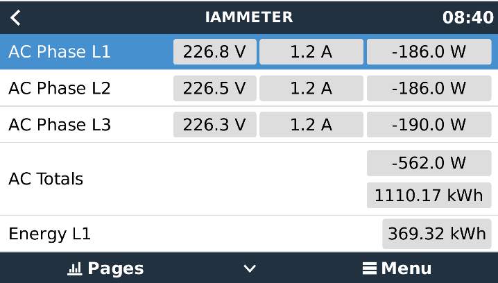
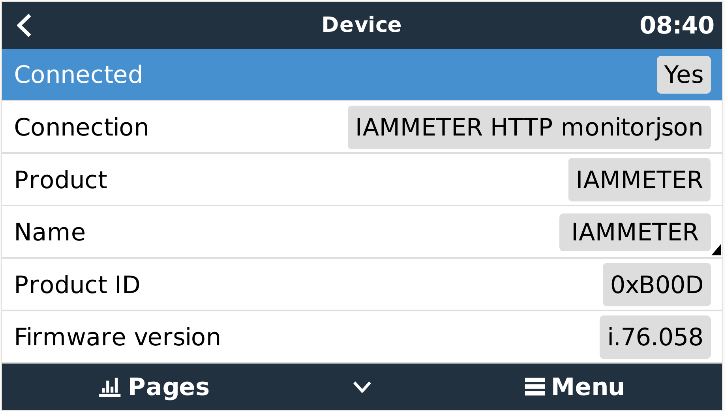

# dbus-iammeter
Integrate IAMMETER WEM3080/WEM3080T/WEM3050T/WEM3046T smart meter into [Victron Energies Venus OS](https://github.com/victronenergy/venus)

## Purpose
With the scripts in this repo it should be easy possible to install, uninstall, restart a service that connects the IAMMETER smart meter(WEM3080/WEM3080T/WEM3050T/WEM3046T) to the VenusOS and GX devices from Victron.
Idea is pasend on @fabian-lauer & @vikt0rm project linked below.


## Inspiration
This project is my first on GitHub and with the Victron Venus OS, so I took some ideas and approaches from the following projects - many thanks for sharing the knowledge:
- https://github.com/RalfZim/venus.dbus-fronius-smartmeter
- https://github.com/victronenergy/dbus-smappee
- https://github.com/Louisvdw/dbus-serialbattery
- https://github.com/victronenergy/venus/wiki/dbus#grid-and-genset-meter
- [IAMMETER Local API](https://www.iammeter.com/newsshow/blog-fw-features)

## How it works
### My setup
- IAMMETER WEM3080/WEM3080T/WEM3050T/WEM3046T
  - 1-Phase/3-Phase installation
  - Connected to Wifi network "A"
  - IP 192.168.1.6
- Venus OS on Raspberry PI 4 4GB version 1.1 - Firmware v2.84
  - No other devices from Victron connected
  - Connected to Wifi network "A"
  - IP 192.168.1.10

### Details / Process
As mentioned above the script is inspired by @RalfZim fronius smartmeter implementation.
So what is the script doing:

- Running as a service
- connecting to DBus of the Venus OS `com.victronenergy.grid.http_40` or `com.victronenergy.pvinverter.http_40`
- After successful DBus connection IAMMETER energy meter is accessed via REST-API - simply the /status is called and a JSON is returned with all details
- Serial/MAC is taken from the response as device serial
- Paths are added to the DBus with default value 0 - including some settings like name, etc
- After that a "loop" is started which pulls IAMMETER(WEM3080/WEM3080T/WEM3050T/WEM3046T) data every 3000ms from the REST-API and updates the values in the DBus

Thats it 😄

### Pictures

 




## Install & Configuration
### Get the code
Just grap a copy of the main branche and copy them to `/data/dbus-iammeter`.
After that call the install.sh script.

The following script should do everything for you:
```
wget https://github.com/lewei50/dbus-iammeter/archive/refs/heads/main.zip
unzip main.zip "dbus-iammeter-main/*" -d /data
mv /data/dbus-iammeter-main /data/dbus-iammeter
chmod a+x /data/dbus-iammeter/install.sh
/data/dbus-iammeter/install.sh
rm main.zip
```
⚠️ Check configuration after that - because service is already installed an running and with wrong connection data (host, username, pwd) you will spam the log-file

### Change config.ini
Within the project there is a file `/data/dbus-iammeter/config.ini` - just change the values - most important is the host, username and password in section "ONPREMISE". More details below:

| Section  | Config vlaue | Explanation |
| ------------- | ------------- | ------------- |
| DEFAULT  | AccessType | Fixed value 'OnPremise' |
| DEFAULT  | SignOfLifeLog  | Time in minutes how often a status is added to the log-file `current.log` with log-level INFO |
| DEFAULT  | CustomName  | Name of your device - usefull if you want to run multiple versions of the script |
| DEFAULT  | DeviceInstance  | DeviceInstanceNumber e.g. 40 |
| DEFAULT  | Role | use 'grid' or 'pvinverter' to set the type of the IAMMETER |
| DEFAULT  | Position | Available Postions: 0=AC input 1; 1=AC output; 2=AC input 2 |
| DEFAULT  | LogLevel  | Define the level of logging - lookup: https://docs.python.org/3/library/logging.html#levels |
| ONPREMISE  | Host | IP or hostname of on-premise IAMMETER energy meter web-interface |
| ONPREMISE  | Username | Username for htaccess login - leave blank if no username/password required |
| ONPREMISE  | Password | Password for htaccess login - leave blank if no username/password required |
| ONPREMISE  | L1Position | Which input on the IAMMTER in 3-phase grid is supplying a single Multi |


### Remapping L1
In a 3-phase grid with a single Multi, Venus OS expects L1 to be supplying the only Multi. This is not always the case. If for example your Multi is supplied by L3 (Input `C` on the IAMMETER) your GX device will show AC Loads as consuming from both L1 and L3. Setting `L1Position` to the appropriate IAMMETER input allows for remapping the phases and showing correct data on the GX device.

If your single Multi is connected to the Input `A` on the IAMMETER you don't need to change this setting. Setting `L1Position` to `2` would swap the `B` CT & Voltage sensors data on the IAMMETER with the `A` CT & Voltage sensors data on the IAMMETER. Respectively, setting `L1Position` to `3` would swap `A` and `C` inputs.

## Used documentation
- https://github.com/victronenergy/venus/wiki/dbus#grid   DBus paths for Victron namespace GRID
- https://github.com/victronenergy/venus/wiki/dbus#pv-inverters   DBus paths for Victron namespace PVINVERTER
- https://github.com/victronenergy/venus/wiki/dbus-api   DBus API from Victron
- https://www.victronenergy.com/live/ccgx:root_access   How to get root access on GX device/Venus OS
- [IAMMETER Local API](https://www.iammeter.com/newsshow/blog-fw-features)
